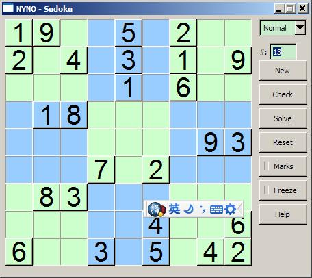

“NYNO - Sudoku (数独)“可以用来帮助你解答数独题目。也可以生成空的数独。改程序使用 Dev-C++ 开发，使用 FLTK 设计 GUI（用户界面）。

Sudoku(数独)，一个填数字的游戏。据称很多人为此着迷。

数独的玩法是在空格子中填入 1-9 中的一个数字，使得每一行、每一列、每一个 3x3 的方块中的数字都唯一（不重复）。

  

功能特性：
--------

  * 解答一个数独。Sudoku Solver
  * 生成一个数独。Sudoku Generator
  * 在空格子内标注可能值。
  * 检查当前解是否正确。

下载
----
  * 从 Google Cod [下载](http://code.google.com/p/nyno/downloads/detail?name=nyno-sudoku_v0.1.exe)

开发日志
-------

  * 2007-08-05: 原型程序完成。

相关资源
-------

  * [Sudoku Strategy](http://www.sudokudragon.com/sudokustrategy.htm)
  * [Sudoku@MathWorld](http://mathworld.wolfram.com/Sudoku.html)
  * [Math of Sudoku@Wikipedia](http://en.wikipedia.org/wiki/Mathematics_of_Sudoku)
  * [Sudoku & Graph Theory](http://www.ddj.com/windows/184406436)

